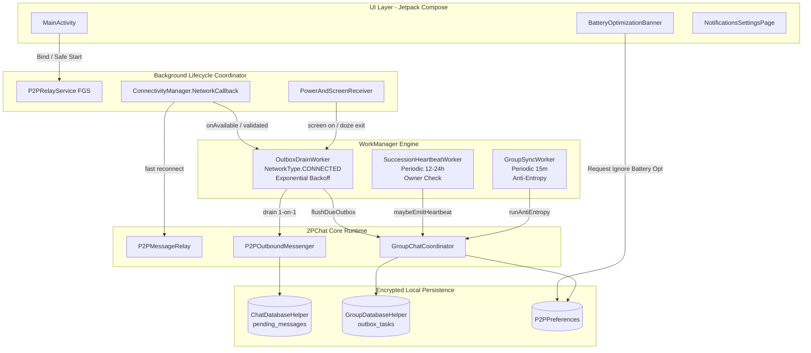
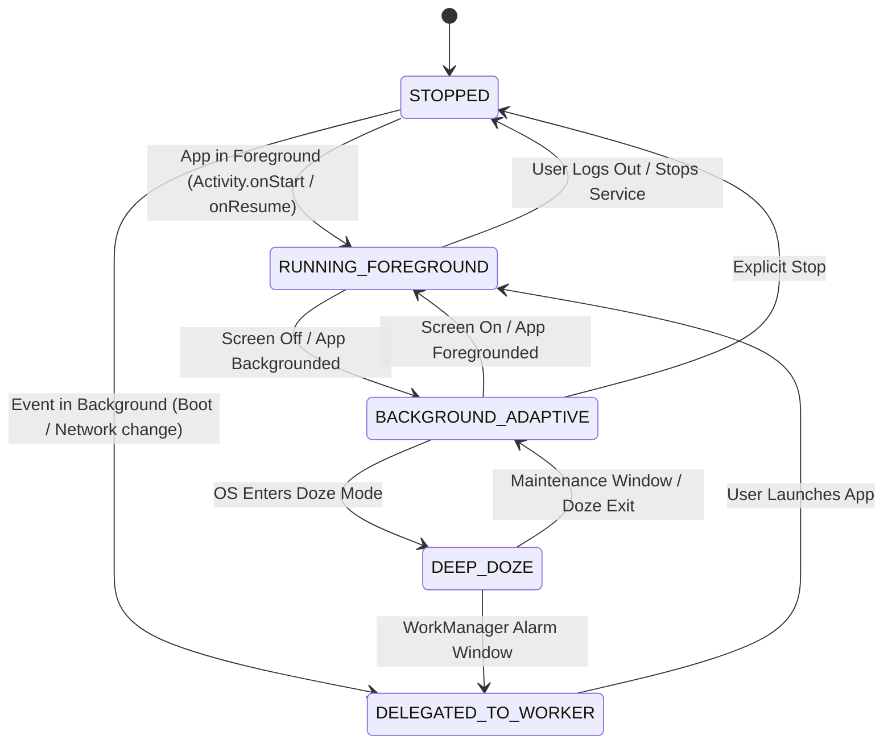

# 2PChat: Mobile Background Persistence Specification (Task 4C)

**Version:** 1.0  
**Status:** Approved Architecture (Sprint 4 Task 4C)  
**Target Platforms:** Android 12+ (API 31–35, Android 12, 13, 14, 15)  
**Security Boundary:** High-risk lifecycle, background execution, durable queues, cryptographic heartbeat  

---

## 1. Контекст и Проблематика

2PChat — децентрализованный peer-to-peer мессенджер с оконечным шифрованием (X3DH, Double Ratchet, Group Ratchet). В архитектуре приложения **отсутствует центральный доверенный сервер** (relay/push-шлюз типа Google FCM или Apple APNs), хранящий очереди сообщений.

В результате доставка сообщений и поддержание состояния групп ложатся исключительно на конечные мобильные клиенты.

### Три критические точки отказа на Android 12+ (API 31–35) без 4C

```
┌──────────────────────────────────────────────────────────────────────────────────┐
│                             CRITICAL FAILURE MODES                               │
├────────────────────────────────┬─────────────────────────────────────────────────┤
│ 1. Succession Heartbeat Gap    │ Создатель группы в Doze 24h+ -> преемник        │
│                                │ начинает клеймить группу -> split-brain         │
├────────────────────────────────┼─────────────────────────────────────────────────┤
│ 2. Outbox Stall                │ Сообщения висят в офлайн-очереди до ручного     │
│                                │ открытия приложения -> иллюзия "не работает"    │
├────────────────────────────────┼─────────────────────────────────────────────────┤
│ 3. Android 12+ FGS Crash       │ startForegroundService() из фона бросает        │
│                                │ ForegroundServiceStartNotAllowedException       │
└────────────────────────────────┴─────────────────────────────────────────────────┘
```

1. **Succession Heartbeat Gap:** Создатель группы (owner) обязан периодически рассылать подписанные heartbeat-пакеты (`maybeEmitHeartbeat`), подтверждая активность. Если система вводит приложение в глубокий сон (Deep Doze) на 24+ часа, преемники считают владельца оффлайн и начинают процедуру смены лидера.
2. **Outbox Stall:** Сообщения 1-на-1 и групповые события, поставленные в очередь (`outbox_tasks` и `pending_messages`), не уходят адресатам при появлении сети до тех пор, пока пользователь не откроет экран.
3. **Android 12–15 FGS Restrictions:** Начиная с Android 12, вызов `startForegroundService()` из фонового состояния (например, по таймеру или из фонового ресивера) приводит к фатальному `ForegroundServiceStartNotAllowedException`. На Android 14+ тип `specialUse` требует строгой валидации типа и описания.

---

## 2. Архитектура Компонентов Task 4C



---

## 3. State Machine: Жизненный Цикл Foreground Service на Android 12–15

Чтобы исключить падения `ForegroundServiceStartNotAllowedException`, переход состояний строго регламентирован:



### Правила Переходов (Invariants)
1. **Никогда не вызывать `startForegroundService` из фоновых компонентов** (ресиверы, асинхронные корутины без привязки к активному UI).
2. **Если приложение на переднем плане:** `MainActivity` запускает или привязывается к `P2PRelayService`. В нотификации отображается статус активного P2P слушателя.
3. **Если приложение в фоне / свёрнуто:** Любая фоновая работа (дренаж outbox, heartbeat, anti-entropy) выполняется исключительно через `WorkManager` (`CoroutineWorker`).
4. **Если сервис уже запущен:** При переходе в фон он продолжает удерживать сокет, адаптируя уровень энергопотребления (освобождение `WIFI_MODE_FULL_HIGH_PERF`, переход на DTIM интервалы).

---

## 4. Спецификация Воркеров WorkManager

### 4.1. `OutboxDrainWorker` (🔴 P0)

**Назначение:** Гарантированная доставка накопленных сообщений 1-на-1 и групповых событий.

- **Семантика результата (P0 Correction):**
  В P2P статус «пир офлайн» — нормальное рабочее состояние, а не ошибка. Использование `Result.retry()` вызовет бессмысленный retry-шторм с экспоненциальным бэкоффом, греющий процессор и сжигающий батарею ради пиров, которые могут не появляться часами.
  Дренаж выполняется по принципу **best-effort**:
  - Сливаем всё, что доступно для отправки в текущий момент.
  - При отсутствии сети или офлайн-пирах возвращается `Result.success()` (очередь персистентна в БД и сольётся по событиям).
  - `Result.retry()` возвращается **только при локальных сбоях** (например, `SQLiteDatabaseLockedException` или сбой инициализации `NativeBridge`).
  - Неперехваченные исключения возвращают `Result.failure()`.

- **Политика App Lock (P0 Correction):**
  Если в приложении настроен пароль/биометрия и приложение заблокировано (`isPasscodeConfigured && isAppLocked`), воркер не может безопасно развернуть ключи/расшифровать БД без фактора пользователя. В этом случае воркер немедленно возвращает `Result.success()`, откладывая дренаж до ввода пароля пользователем.

- **Headless-профиль (P0 Correction):**
  Воркер выполняется в чистом фоновом режиме: не инициирует запуск Tor-демона, не вызывает `startForegroundService`, не прогревает UI-компоненты.

- **Триггеры дренажа:**
  1. `P2PMessageRelay.onSessionEstablished` — появление пира в сети (главный P2P-триггер).
  2. `NetworkCallback.onAvailable` — появление сетевого подключения.
  3. `MainActivity.onStart` — возврат приложения на передний план (catch-up drain).
  4. Выход из Doze mode (`ACTION_DEVICE_IDLE_MODE_CHANGED`).
  5. Отправка пользователем при офлайн-пире — постановка `Expedited` work.
  6. Периодический fallback (`ExistingPeriodicWorkPolicy.KEEP`, 15 мин).

### 4.2. `SuccessionHeartbeatWorker` (🟡 P1)

**Назначение:** Защита от потери владения группой из-за затяжного Doze mode.

- **Интервал:** Периодический раз в 12 часов (`ExistingPeriodicWorkPolicy.KEEP`), flex interval 2 часа.
- **Constraints:**
  - `NetworkType.CONNECTED`.
- **Идемпотентность и безопасность:**
  1. Загрузить список групп из `GroupDatabaseHelper`.
  2. Отфильтровать только группы, где `localDeviceId == ownerDeviceId`.
  3. Для каждой группы проверить время последнего emit:
     `System.currentTimeMillis() - lastEmitTime >= MIN_HEARTBEAT_INTERVAL_MS (1 hour)`.
  4. Если прошло >= 24 часов с момента последней отправки (или дедлайн приближается):
     - Вызвать `GroupChatCoordinator.maybeEmitHeartbeat(groupId, force = false)`.
     - Сформировать heartbeat, подписать закрытым ключом создателя, поместить в `outbox_tasks`.
     - Немедленно пнуть `OutboxDrainWorker`.
  5. Вернуть `Result.success()`.

---

## 5. Стратегия Battery Optimization Whitelist (🟡 P1)

Android Doze Mode отключает сетевой доступ и замораживает фоновые сокеты приложений, не находящихся в белом списке оптимизации батареи.

### Дерево решений (Decision Tree)

```
                       [Проверка при запуске чата/главного экрана]
                                         │
                 PowerManager.isIgnoringBatteryOptimizations(pkg)?
                                  ┌──────┴──────┐
                                ДА             НЕТ
                                │               │
                         [Всё отлично]   Пользователь уже
                       Скрывать баннер   отклонил баннер?
                                          ┌─────┴─────┐
                                         ДА          НЕТ
                                          │           │
                                     [Тишина]    Показать баннер
                                 В настройках    вверху чат-листа
                                 всегда доступен      │
                                                 [Нажатие "Разрешить"]
                                                      │
                                           ACTION_REQUEST_IGNORE_
                                           BATTERY_OPTIMIZATIONS
                                                      │
                                           (Fallback: Settings.
                                            ACTION_IGNORE_BATTERY_
                                            OPTIMIZATION_SETTINGS)
```

### UI/UX требования
- **Баннер:** Компактная плашка над списком диалогов:
  *«Включите фоновую работу, чтобы мгновенно получать сообщения без задержек»* + кнопка *«Настроить»* и кнопка закрытия `(X)`.
- **Локализация:** Поддержка всех 7 языков (ru, en, de, es, fr, pt, tr).
- **Настройки:** Полноценный переключатель в разделе `NotificationsSettingsPage`.

---

## 6. Интеграция с Сетью (Network Callback Engine)

Приложение отслеживает состояние сети через `ConnectivityManager.NetworkCallback`:

```kotlin
val callback = object : ConnectivityManager.NetworkCallback() {
    override fun onAvailable(network: Network) {
        // 1. Уведомляем нативный C/Go слой о смене интерфейса
        NativeBridge.onNetworkChanged()
        // 2. Сбрасываем экспоненциальный бэкофф пиров
        P2PMessageRelay.resetPeerBackoffs()
        // 3. Запускаем мгновенный дренаж Outbox через WorkManager
        OutboxWorkScheduler.triggerImmediateDrain(context)
    }

    override fun onCapabilitiesChanged(network: Network, caps: NetworkCapabilities) {
        if (caps.hasCapability(NetworkCapabilities.NET_CAPABILITY_VALIDATED)) {
            OutboxWorkScheduler.triggerImmediateDrain(context)
        }
    }

    override fun onLost(network: Network) {
        NativeBridge.onNetworkChanged()
    }
}
```

---

## 7. Чек-лист Реализации и План Валидации

| Шаг | Задача | Файлы изменений | Валидация |
|:---|:---|:---|:---|
| **Шаг 1** | Архитектурная спецификация | `MOBILE_BACKGROUND_PERSISTENCE.md` | Ревью архитектуры |
| **Шаг 2** | `OutboxDrainWorker` + Scheduler | `OutboxDrainWorker.kt`, `OutboxWorkScheduler.kt` | Unit tests (`WorkManagerTestInitHelper`) |
| **Шаг 3** | `SuccessionHeartbeatWorker` | `SuccessionHeartbeatWorker.kt` | Тест идемпотентности, `maybeEmitHeartbeat` |
| **Шаг 4** | Battery Whitelist UI & Safety | `BatteryOptimizationBanner.kt`, `MainActivity.kt` | Compose preview, StateFlow reactivity |
| **Шаг 5** | End-to-End & ADB Doze тест | CI pipeline + ADB test script | `./gradlew test`, симуляция Doze mode |
