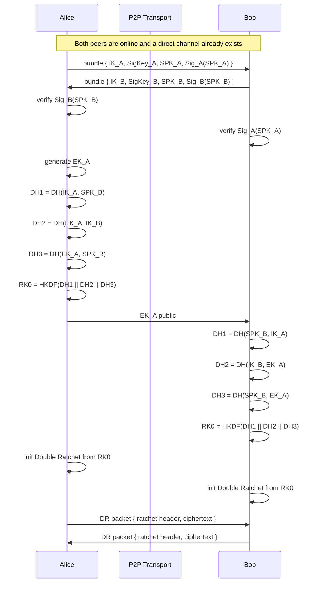
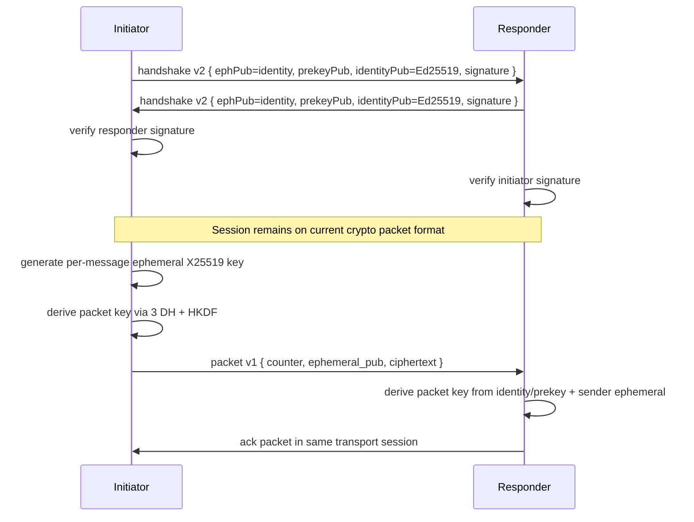
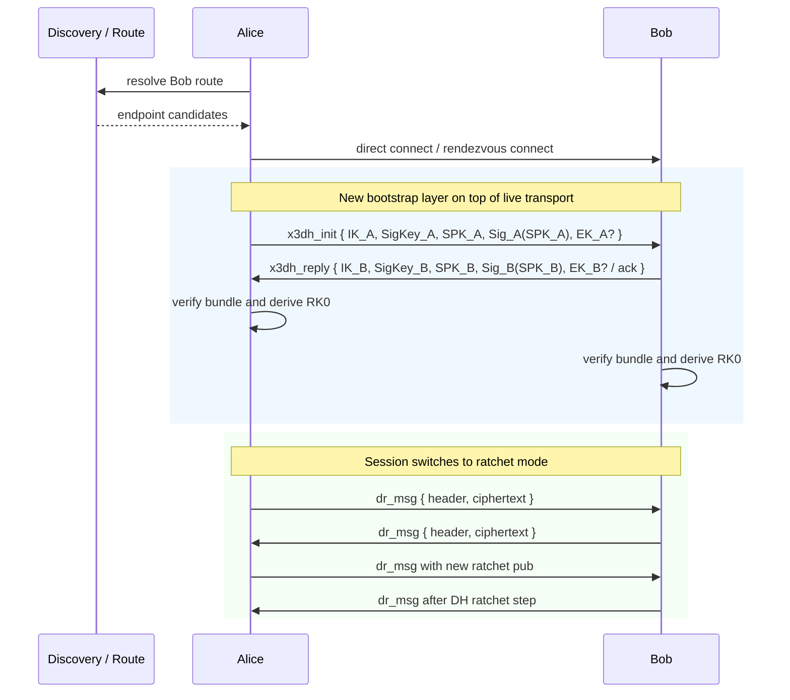

# P2P Signal Adaptation Notes

This document reproduces the key handshake and message-flow ideas from the
positive-intentions P2P Signal write-up, then maps them onto the current
`2pchat` codebase.

Source material:

- Article: <https://positive-intentions.com/blog/p2p-signal-protocol/>
- Supporting auth notes: <https://positive-intentions.com/docs/research/authentication/>
- JS cryptography repo: <https://github.com/positive-intentions/cryptography>
- Browser signal-protocol repo: <https://github.com/positive-intentions/signal-protocol>

Important note:

- The article explicitly says it is unfinished and subject to change.
- The goal here is to reproduce the architecture and exchange flow, not to
  treat it as a drop-in spec.

## Their P2P Signal-Like Flow

The article's core idea is:

1. Establish a live P2P transport first.
2. Exchange identity and signed-prekey bundles in real time.
3. Perform 3-DH X3DH-style bootstrap without one-time prekeys.
4. Immediately initialize Double Ratchet.
5. Send all application messages through the ratchet session.

## Current 2pchat Flow

Current `2pchat` already has:

- live signed handshake in `messenger/core/session.py`
- X25519 identity key
- Ed25519 signing key
- X25519 prekey
- per-message ephemeral encryption in `messenger/core/crypto.py`

What it does not yet do in the main session path is hand control over to
Double Ratchet after bootstrap.

## Target 2pchat v3 Flow

To converge on the article's approach without introducing a central server, the
clean migration is:

1. Keep discovery focused on route establishment.
2. Establish a direct transport channel.
3. Exchange explicit P2P X3DH bundles on that channel.
4. Derive an initial root key with 3-DH.
5. Switch all message traffic to Double Ratchet packets.

## What We Need To Change

| Area | Current | Target |
|---|---|---|
| Handshake payload | `handshake version 2` with historical field meanings | explicit `x3dh` bootstrap message with unambiguous field names |
| Initiator ephemeral | per-message only | dedicated bootstrap ephemeral key |
| Session state | mostly packet-by-packet | persistent root key, chain keys, ratchet keys, skipped keys |
| Runtime encryption | `crypto.encrypt_message/decrypt_message` packet format | `double_ratchet.encrypt_message/decrypt_message` packet format |
| Contact model | trust store + discovery route | trust store + stable identity + last route + ratchet state |
| Protocol vectors | current v2 handshake + packet vectors | new v3 X3DH + DR vectors for Python and Kotlin |

## Code Mapping

Current code locations:

- Handshake: `messenger/core/session.py`
- Current packet crypto: `messenger/core/crypto.py`
- Experimental Double Ratchet: `messenger/core/double_ratchet.py`
- Protocol spec: `docs/PROTOCOL.md`
- Golden fixtures: `messenger/tests/fixtures/protocol_vectors.json`

Recommended implementation split:

1. Introduce a new protocol version instead of mutating `version 2`.
2. Add explicit X3DH bundle objects and serialization helpers.
3. Add persisted ratchet session state keyed by peer identity.
4. Switch `Session` to DR packets only for the new version.
5. Keep current v2 support during migration for compatibility and testing.

## Practical Repo References

The positive-intentions article points at two relevant repos:

- `positive-intentions/cryptography`
- `positive-intentions/signal-protocol`

For our purposes, the useful parts to mirror are:

- real-time bundle exchange over an already-established channel
- 3-DH bootstrap without server-managed one-time prekeys
- immediate Double Ratchet session initialization
- packet flow diagrams that separate route establishment from crypto bootstrap

What we should not mirror blindly:

- WebRTC-specific assumptions
- transport-layer security assumptions that do not apply to our direct TCP mode
- any unfinished API shape from the article without first freezing our own spec

## Suggested Next Steps

1. Add `protocol_version = 3` with explicit `x3dh_init` and `x3dh_reply`.
2. Define a new DR packet envelope in `docs/PROTOCOL.md`.
3. Generate new golden vectors for X3DH bootstrap and first DR messages.
4. Implement dual-stack session support: current v2 and new v3.
5. Only after that update GUI and Kotlin integration to prefer v3.
